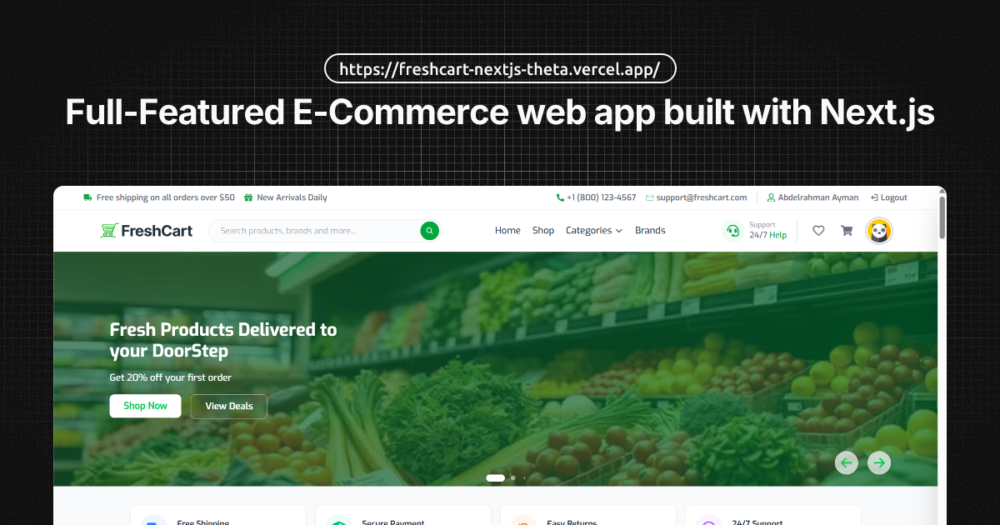

<div align="center">


# FreshCart 🛒

### A full-featured e-commerce web application built with Next.js 16, React 19, and TypeScript

[](https://nextjs.org/)
[](https://react.dev/)
[](https://www.typescriptlang.org/)
[](https://tailwindcss.com/)
[](https://github.com/Abdelrahman968/freshcart-nextjs/blob/main/CHANGELOG.md)
[](https://freshcart-nextjs-theta.vercel.app/)

[**🌐 Live Demo**](https://freshcart-nextjs-theta.vercel.app/) · [**📐 Figma Design**](https://www.figma.com/design/7GOjynvDWj2Lnbb4IKjbXK/Freshcart---E-Commerce-?node-id=61-52&t=acwvWdS7QJmfu0EI-0) · [**📡 API Docs**](https://documenter.getpostman.com/view/5709532/2s93JqTRWN#intro)

</div>

---

## 📸 Preview

> **[🔗 View Live Demo →](https://freshcart-nextjs-theta.vercel.app/)**

<!-- Replace with actual screenshots -->



---

## ✨ Features

### 🔐 Authentication

- Credentials-based login and registration via **NextAuth v4**
- JWT decoding and session callbacks with `routeToken` and `expiresAt`
- Automatic login immediately after successful registration
- Secure HTTP-only session cookies (`fresh-cart.session-token`)
- Protected routes enforced via Next.js **middleware proxy**
- Reset password flow with full UI

### 🛒 Cart & Wishlist

- Full cart management — add, update quantity, remove, and clear
- Wishlist support with add/remove functionality
- Both features use the **BFF (Backend For Frontend) pattern** via Next.js API Routes
- **Redux Toolkit** manages all cart and wishlist state client-side
- Per-product loading states tracked independently in Redux slices
- Cart item count badge in the NavBar with live updates

### 📦 Products

- Product listing with **pagination** and **subcategory filtering**
- Product details page with image gallery, reviews, and share button
- Dynamic **metadata per product** for SEO
- Product search with **debounced** input
- `ProductSwiper` component for featured/related products

### ⭐ Reviews

- Product review submission with **star rating** (`@smastrom/react-rating`)
- Review listing with total count per product
- Integrated via BFF pattern — form handling with **React Hook Form + Controller**

### 👤 Profile & Address Management

- User profile page with editable settings
- Full **address CRUD** — add, edit, delete shipping addresses
- All profile mutations go through dedicated Next.js API Routes (BFF)

### 🎨 UI & UX

- Component library powered by **HeroUI v2**
- Smooth page transitions via **Framer Motion** and `nprogress`
- Fully responsive layout across all screen sizes
- **Network status toast** — detects and shows offline/online state
- `PageHeader` component with consistent page-level branding
- Static informational pages: Help, Shipping, Returns, TrackOrder, Privacy, Terms, Cookies, Contact

---

## 🏗️ Architecture — BFF Pattern

FreshCart uses the **Backend For Frontend (BFF)** pattern to keep sensitive API calls server-side and avoid exposing tokens to the browser.

```
Browser (Client Component)
        │
        │  fetch('/api/cart/add')
        ▼
Next.js API Routes  ◄── BFF Layer
        │
        │  fetch('https://ecommerce.routemisr.com/...', { Authorization: token })
        ▼
External REST API (Route Academy)
```

**Benefits:**

- Session tokens never leave the server
- Centralized error handling and response shaping
- Decoupled client components from external API contracts
- Redux thunks call internal `/api/*` routes, not the external API directly

---

## 🚀 Tech Stack

| Category             | Technology                                                                                      |
| -------------------- | ----------------------------------------------------------------------------------------------- |
| **Framework**        | [Next.js 16](https://nextjs.org/) (App Router)                                                  |
| **Library**          | [React 19](https://react.dev/)                                                                  |
| **Language**         | [TypeScript 5](https://www.typescriptlang.org/)                                                 |
| **Styling**          | [Tailwind CSS v4](https://tailwindcss.com/)                                                     |
| **UI Components**    | [HeroUI v2](https://www.heroui.com/)                                                            |
| **Animations**       | [Framer Motion](https://www.framer.com/motion/)                                                 |
| **State Management** | [Redux Toolkit](https://redux-toolkit.js.org/) + [React Redux](https://react-redux.js.org/)     |
| **Authentication**   | [NextAuth v4](https://next-auth.js.org/)                                                        |
| **Form Handling**    | [React Hook Form](https://react-hook-form.com/)                                                 |
| **Icons**            | [React Icons](https://react-icons.github.io/react-icons/) + [Lucide React](https://lucide.dev/) |
| **Carousel**         | [Swiper](https://swiperjs.com/)                                                                 |
| **Rating**           | [@smastrom/react-rating](https://github.com/smastrom/react-rating)                              |
| **JWT**              | [jsonwebtoken](https://github.com/auth0/node-jsonwebtoken)                                      |
| **Utilities**        | `clsx`, `tailwind-merge`, `class-variance-authority`, `use-debounce`, `nprogress`               |

---

## 📂 Project Structure

```
src/
├── app/
│   ├── (Auth)/               # Authentication routes (Login, Register, Reset Password)
│   ├── (Pages)/              # Main app routes
│   │   ├── products/         # Product listing & details
│   │   │   └── [id]/
│   │   ├── cart/             # Cart page
│   │   ├── wishlist/         # Wishlist page
│   │   ├── checkout/         # Checkout flow
│   │   ├── account/          # Profile, addresses, orders, settings
│   │   ├── categories/       # Categories listing
│   │   ├── brands/           # Brands listing
│   │   ├── track-order/      # Order tracking
│   │   ├── changelog/        # App changelog
│   │   └── (legal)/          # Help, Shipping, Returns, Privacy, Terms, Cookies
│   ├── api/                  # BFF API Routes (cart, wishlist, auth, reviews, addresses)
│   ├── layout.tsx            # Root layout + Providers
│   └── page.tsx              # Home page
├── components/               # Shared UI components
│   ├── Navbar/
│   ├── Footer/
│   ├── PageHeader/
│   ├── Breadcrumb/
│   └── ...
├── store/                    # Redux store, slices, and thunks
│   ├── store.ts
│   ├── cartSlice.ts
│   ├── wishlistSlice.ts
│   └── ...
├── services/                 # API utilities and external service helpers
├── types/                    # TypeScript interfaces and type definitions
├── data/                     # Static constants and mock data
└── assets/                   # Images, icons, and brand materials
```

---

## 🛠️ Getting Started

### Prerequisites

- Node.js **18+**
- npm / yarn / pnpm / bun

### Installation

```bash
# 1. Clone the repository
git clone https://github.com/Abdelrahman968/freshcart-nextjs.git

# 2. Navigate to the project directory
cd freshcart-nextjs

# 3. Install dependencies
npm install
```

### Environment Variables

Create a `.env.local` file in the root directory:

```env
NEXTAUTH_URL=http://localhost:3000
NEXTAUTH_SECRET=your_nextauth_secret_here

# Route Academy API Base URL
NEXT_PUBLIC_API_BASE_URL=https://ecommerce.routemisr.com
```

### Run the Development Server

```bash
npm run dev
```

Open [http://localhost:3000](http://localhost:3000) in your browser.

### Build for Production

```bash
npm run build
npm run start
```

---

## 🌐 API

This project consumes the **Route Academy E-Commerce REST API**.

| Resource      | Base URL                                                                        |
| ------------- | ------------------------------------------------------------------------------- |
| API Server    | `https://ecommerce.routemisr.com`                                               |
| Documentation | [Postman Docs](https://documenter.getpostman.com/view/5709532/2s93JqTRWN#intro) |

All API calls from the client side go through the internal BFF layer at `/api/*`, which forwards requests to the external API with the authenticated session token.

---

## 🗺️ Roadmap

- [ ] Add order history page with real order data
- [ ] Implement product search results page
- [ ] Add email notifications for order status
- [ ] Write unit tests for Redux slices and BFF routes
- [ ] Add PWA support

---

## 📄 Changelog

See [CHANGELOG](https://freshcart-nextjs-theta.vercel.app/changelog) for the full release history.  
Current version: **v3.2.4**

---

## 👨‍💻 Author

**Abdelrahman Ayman**

[](https://github.com/Abdelrahman968)
[](https://www.linkedin.com/in/abdelrahman968/)
[](https://www.facebook.com/Abdelrahman.968)

---

## 📐 Design

The UI was designed in Figma before implementation.  
[**View Figma File →**](https://www.figma.com/design/7GOjynvDWj2Lnbb4IKjbXK/Freshcart---E-Commerce-?node-id=61-52&t=acwvWdS7QJmfu0EI-0)

---

## 📜 License

This project is open source and available under the [MIT License](LICENSE).

---

<div align="center">

Made with ❤️ by [Abdelrahman Ayman](https://github.com/Abdelrahman968)

⭐ Star this repo if you found it helpful!

</div>
